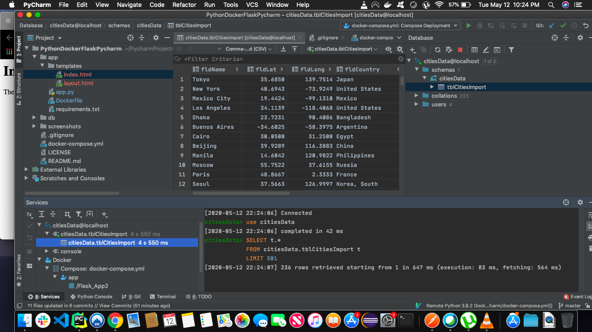
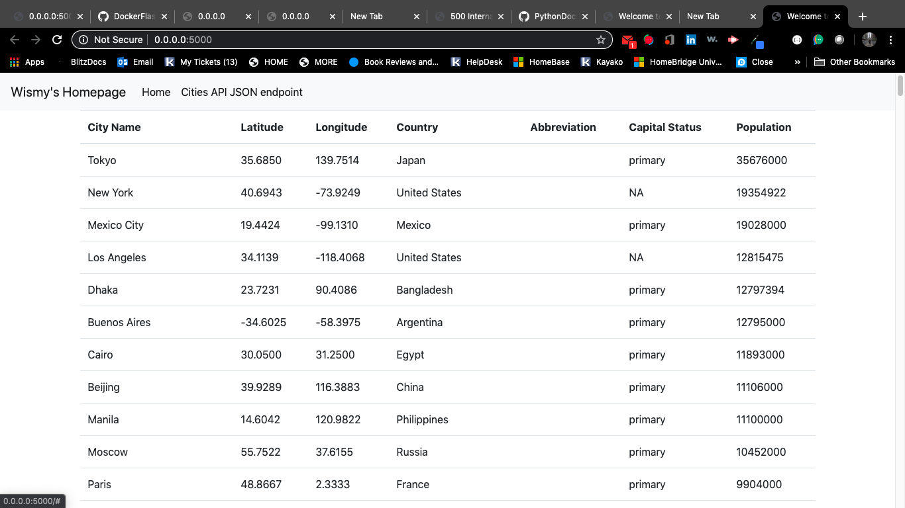
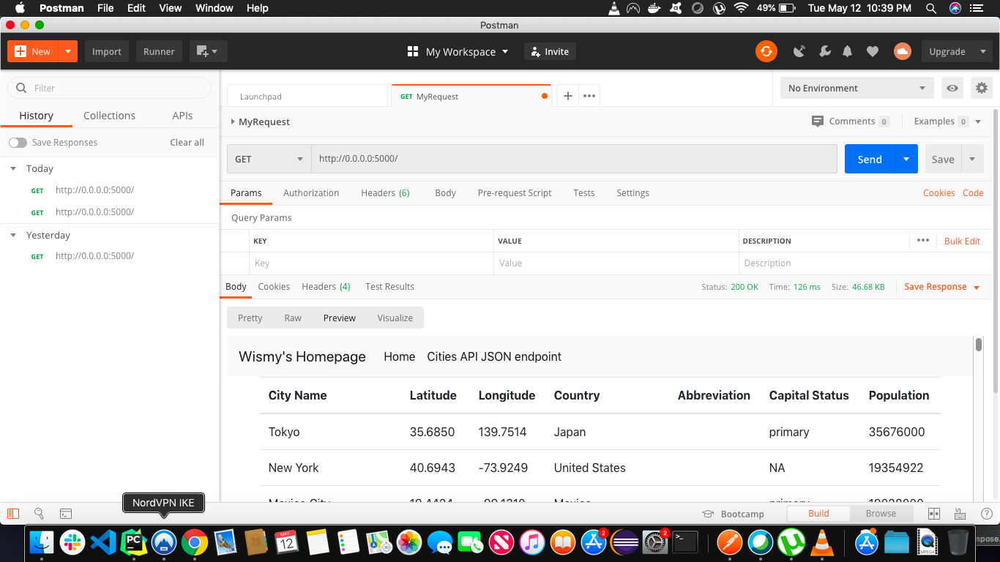

# PythonDockerFlaskPycharm Assignment 2
###### By Wismy Seide

# Project Description
This project is a homework assignment to teach how to get Pycharm setup with Docker, Flask, MySQL, and Postman and now adding Bootstrap

# Database Screenshot

# Bootstrap Screenshot

# Postman Bootstrap Screenshot

